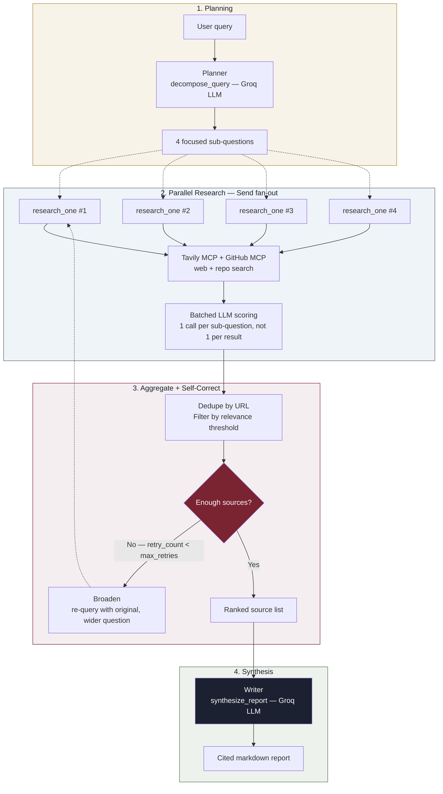

[](https://github.com/Yuvrajpawar45/ResearchLoop-AI)

[](https://www.python.org/)
[](https://fastapi.tiangolo.com/)
[](https://langchain-ai.github.io/langgraph/)
[](https://groq.com/)
[](https://modelcontextprotocol.io/)
[](./LICENSE)

**An autonomous research agent that decomposes a question, researches every angle of it in parallel, self-corrects when evidence is thin, and writes a report that cites exactly where every claim came from.**

🔗 **Live demo:** [research-loop-ai-theta.vercel.app](https://research-loop-ai-theta.vercel.app) · **API:** [researchloop-ai.onrender.com](https://researchloop-ai.onrender.com)

---

## Why this exists

Most "AI research agent" demos run a single search, hand the top few results to an LLM, and call it done — fast, but shallow, and it has no way to notice when the first pass came back thin. ResearchLoop takes the slower, more honest path: it **decomposes** a question into four distinct angles before searching anything, runs all four **in parallel** against live web and code sources, and — critically — **checks its own output**. If the research phase comes back with too few relevant sources, the graph doesn't just write a thin report anyway; it loops back, broadens the query, and tries again once before giving up.

That self-correcting loop, running over a genuinely parallel LangGraph fan-out, is the core idea the name is built around.

---

## Architecture



Five real LangGraph nodes: `planner` → `research_one` (fanned out ×4 via `Send()`) → `aggregate` → conditionally `broaden` (loops back) → `writer`.

---

## Pipeline stages

| # | Stage | What happens |
|---|---|---|
| 1 | **Decompose** | Groq splits the query into 4 sub-questions: definition, comparison, use cases, limitations |
| 2 | **Fan out** | All 4 sub-questions dispatch as parallel LangGraph `Send()` branches — not a sequential loop |
| 3 | **Search** | Each branch queries Tavily MCP (live web) and GitHub MCP (repositories) concurrently |
| 4 | **Score** | One batched LLM call scores *all* of a sub-question's results at once, not one call per result |
| 5 | **Aggregate** | Results from every branch merge, dedupe by URL, filter by relevance threshold, rank |
| 6 | **Self-correct** | If too few sources cleared the bar, loop back once with the original (broader) query |
| 7 | **Synthesize** | Writer turns the final ranked sources into a cited markdown report |

---

## Evaluation

Run against a fixed 20-query test set (`eval/eval_harness.py`), computing real metrics — not a claimed number:

| Metric | Result |
|---|---|
| Successful runs | 20 / 20 |
| Reports passing (cited, sourced) | 19 / 20 (95%) |
| Sources scoring ≥ 0.7 relevance | 98.2% |
| Avg. sources per query | 13.7 |
| Avg. time per query | 42.7s |

```bash
cd backend
python -m eval.eval_harness
```

Writes full per-query results to `eval/results.json` — every number above is reproducible, not eyeballed.

---

## Tech stack

| Layer | Choice |
|---|---|
| Orchestration | LangGraph `StateGraph`, `Send()` parallel fan-out, conditional edges |
| Tool integration | Model Context Protocol via `langchain-mcp-adapters` |
| Web search | Tavily MCP server |
| Code search | GitHub MCP server |
| Generation & scoring | Groq `llama-3.3-70b-versatile`, automatic fallback to `llama-3.1-8b-instant` |
| Backend | FastAPI, `slowapi` rate limiting, explicit CORS allowlist |
| Streaming | Server-Sent Events (SSE) for live per-node progress |
| Testing | `pytest` + `pytest-asyncio` — MCP health, full pipeline, failure modes |
| Frontend | Static HTML/CSS/JS, no build step, live SSE-driven diagram |
| Deployment | Render (Docker, backend) + Vercel (frontend) |

---

## Design notes

- **Why parallel `Send()` instead of a sequential loop?** An earlier version researched sub-questions one at a time. Parallelizing them cut wall-clock time significantly — but it surfaced a real production bug worth documenting: four branches calling the MCP tool-loading code simultaneously on a cold start raced to install the same npm packages into the same cache directory, corrupting it. The fix was two-fold — an `asyncio.Lock` around first-time tool initialization, and moving MCP server installation to **Docker build time** instead of runtime `npx`, so there's no download to race on at all in production.
- **Why batch the LLM scoring call?** The original version made one scoring call per search result — with 4 parallel branches × ~10 results each, that's up to ~40 near-simultaneous Groq calls, which reliably blew through the free-tier rate limit under sustained load. Batching all of one sub-question's results into a single scoring call cut that to ~4-5 calls per query total.
- **Why self-correction instead of just writing whatever comes back?** A thin report that quietly under-delivers is worse than one that visibly retries. The broadening strategy is deliberately simple (fall back to the original, unmodified query) rather than an LLM-driven reformulation — a real, stated next step rather than a hidden gap.
- **Why MCP instead of calling the Tavily/GitHub REST APIs directly?** Tools are exposed as standard LangChain `BaseTool` objects regardless of provider, so a different search or code-search backend can be swapped in later without touching any node logic. The tradeoff: subprocess-based MCP servers add startup latency and one more moving part to deploy — worth it here to keep the tool layer standardized and swappable.

---

## Testing

```bash
cd backend
pytest tests/test_mcp_health.py -v      # MCP connection smoke tests, no LLM calls
pytest tests/test_failure_modes.py -v   # input validation, no API calls
pytest tests/test_pipeline.py -v -s     # full pipeline + self-correction, requires live API keys
```

---

## Setup

### 1. Get free API keys

| Service | URL |
|---|---|
| Groq | console.groq.com |
| Tavily | app.tavily.com |
| GitHub token | github.com/settings/tokens |

### 2. Backend

```bash
cd backend
python -m venv venv
source venv/bin/activate   # Windows: venv\Scripts\activate
pip install -r requirements.txt
cp .env.example .env       # fill in your keys
uvicorn app.main:app --reload --port 8000
```

Node.js 18+ is required locally (MCP servers launch via `npx` in dev). In Docker/production, packages are installed at build time — see `Dockerfile`.

### 3. Frontend

Edit `API_BASE` in `frontend/index.html` to point at your backend, then open it directly — no build step.

### 4. Deploy

- **Backend → Render**: Docker runtime, root directory `backend`, health check path `/api/health`, set `GROQ_API_KEY` / `TAVILY_API_KEY` / `GITHUB_TOKEN` / `ALLOWED_ORIGINS` as environment variables.
- **Frontend → Vercel**: root directory `frontend`, no build command.

---

## API

```
POST /api/research
{ "query": "What is Model Context Protocol?" }
```

```json
{
  "query": "What is Model Context Protocol?",
  "sub_questions": ["...", "...", "...", "..."],
  "sources": [{ "title": "...", "url": "...", "relevance_score": 0.9, "source": "tavily" }],
  "report": "# Executive Summary\n...",
  "source_count": 14,
  "retries_used": 0
}
```

`POST /api/research/stream` — same input, streams `node_update` SSE events per graph node.
`GET /api/health` — liveness check.
`GET /api/health/mcp` — confirms both MCP servers are connected and lists their tools.

---

## Project structure

```
ResearchLoop-AI/
├── backend/
│   ├── app/
│   │   ├── graphs/
│   │   │   ├── planner.py         # decompose_query — degrades gracefully on LLM failure
│   │   │   ├── research_worker.py # research_one — one parallel Send() branch
│   │   │   ├── aggregate.py       # dedupe/filter/rank + self-correction router
│   │   │   ├── broaden.py         # self-correction retry node
│   │   │   └── writer.py          # synthesize_report — degrades gracefully on LLM failure
│   │   ├── routers/
│   │   │   ├── health.py
│   │   │   └── research.py        # rate-limited endpoints, SSE streaming
│   │   ├── mcp_client.py          # MCP server connections (build-time installed binaries)
│   │   ├── mcp_search.py          # shared search + batched scoring logic
│   │   ├── llm.py                 # Groq client with automatic fallback model
│   │   ├── limiter.py             # shared slowapi rate limiter
│   │   ├── state.py               # ResearchState TypedDict
│   │   ├── graph_builder.py       # wires nodes, Send() fan-out, self-correction edge
│   │   └── main.py                # FastAPI app, locked-down CORS
│   ├── tests/
│   ├── eval/
│   │   └── eval_harness.py
│   ├── Dockerfile                 # installs MCP servers at build time, not runtime
│   └── requirements.txt
└── frontend/
    └── index.html                 # landing page + live SSE demo
```

---

## Roadmap

- [ ] LLM-driven query reformulation for the self-correction loop, instead of falling back to the original query
- [ ] Session memory across follow-up questions
- [ ] CI-integrated eval run on every push

---

## Known limitations

Stated plainly, not hidden:

- **Self-correction broadening is a fixed strategy** — falls back to the original query rather than an LLM-diagnosed reformulation of *why* the first pass came up thin.
- **No vector DB or persistent memory** — each query is stateless.
- **Rate limiting is per-IP and in-memory** — resets on restart, doesn't share state across instances. Fine for a portfolio deployment, not for production scale.
- **Render's free tier spins down on inactivity** — first request after idle time can take 30–40s to wake up.

## License

MIT — see [LICENSE](./LICENSE)

---

Built by [Yuvraj Pawar](https://github.com/Yuvrajpawar45)